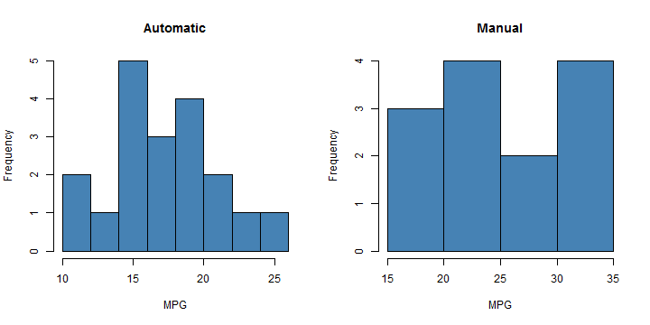
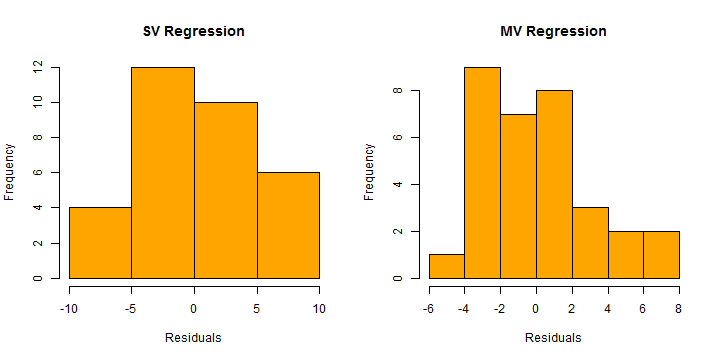

Regression Models ----- (Motor Trend)
========================================================

# Executive Summary.

In the automobile industry, the type of transmission has always played a crucial role to the mileage of that vehicle. In his report i present  a detailed report. First we will perform our analysis on a simple linear model with 'mpg' as outcome and 'automatic' as predictor. Then we will use Instrumental variable method and explain the reason why it has been used here.

# Exploratory Data Analysis.

Lets load the dataset and perform initital inspection. We came to know that the "am" variable which tells whether a vehicle has automatic(0)/manual(1) transmission is of type numeric. Lets create a new variable "automatic" which has a logical value(T/F).

```r
data(mtcars)
mtcars$automatic = mtcars$am == 0
```

Below is a plot of mpg aganist type of transmission. We can see that the maximum mileage/gallon for automatic is around 24.4 and for manual it is around 33.9.

```r
par(mfrow = c(1, 2))
hist(mtcars$mpg[which(mtcars$automatic == TRUE)], col = "steelblue", xlab = "MPG", 
    main = "Automatic")
hist(mtcars$mpg[which(mtcars$automatic == FALSE)], col = "steelblue", xlab = "MPG", 
    main = "Manual")
```

 


# Regression Models.
## Simple Linear regression.
Now lets try fitting models on our data. First we will try to create a single variable model with mpg as outcome and automatic as predictor.

```r
model.lm = lm(mpg ~ automatic, data = mtcars)
model.lm  # for detailed report use 'summary(model.lm)'
```

```
## 
## Call:
## lm(formula = mpg ~ automatic, data = mtcars)
## 
## Coefficients:
##   (Intercept)  automaticTRUE  
##         24.39          -7.24
```

By interpreting the coefficients of the above regression model. We came to know that 
*the estimated expected change in mpg is about 7.245.*  
In clear terms
- The estimated expected mpg values for automatic vehicles gives 7.245mpg less than the vehicles with manual transmission.  
  OR
- The estimated expected mpg values for manual vehicles gives 7.245mpg more than the vehicles with automatic transmission. 

## Regression using Instrumental variables.

Standard linear regression models assume that errors in the dependent variable are uncorrelated with the independent variable(s). When this is not the case (for example, when relationships between variables are bidirectional), linear regression using ordinary least squares (OLS) no longer provides optimal model estimates. Two-stage least-squares regression uses instrumental variables that are uncorrelated with the error terms to compute estimated values of the problematic predictor(s) (the first stage), and then uses those computed values to estimate a linear regression model of the dependent variable (the second stage). Since the computed values are based on variables that are uncorrelated with the errors, the results of the two-stage model are optimal.

We will be using the 'wt' variable as our problematic predictor/ Instrumental variable.
Below is the code which implements the method discussed above.

```r
model.fs = lm(automatic ~ wt, data = mtcars)  # first stage.
model.IV = lm(mpg ~ model.fs$fitted.values, data = mtcars)  # second stage.
model.IV  # for detailed report use 'summary(model.IV)'
```

```
## 
## Call:
## lm(formula = mpg ~ model.fs$fitted.values, data = mtcars)
## 
## Coefficients:
##            (Intercept)  model.fs$fitted.values  
##                   29.1                   -15.1
```

As we can see the coefficiant has aslmost doubled now with more significant value than the previous one. 

## Residual Plots.
Below is the plots of single variable and Regression using Instrumental variables residuals.

```r
par(mfrow = c(1, 2))
hist(model.lm$residuals, xlab = "Residuals", main = "SV Regression", col = "orange")
hist(model.IV$residuals, xlab = "Residuals", main = "MV Regression", col = "orange")  # MV = Multiple Variable
```

 

# Result.
- “Is an automatic or manual transmission better for MPG ?”  

From our analysis look at the result of simple linear regression the manual transmission vehicles have more better milleage/gallon value.

- “Quantifying how different is the MPG between automatic and manual transmissions ?”  

From our analysis look at the result of model.lm coefficients the estimated expected change in mpg is about 7.245.
